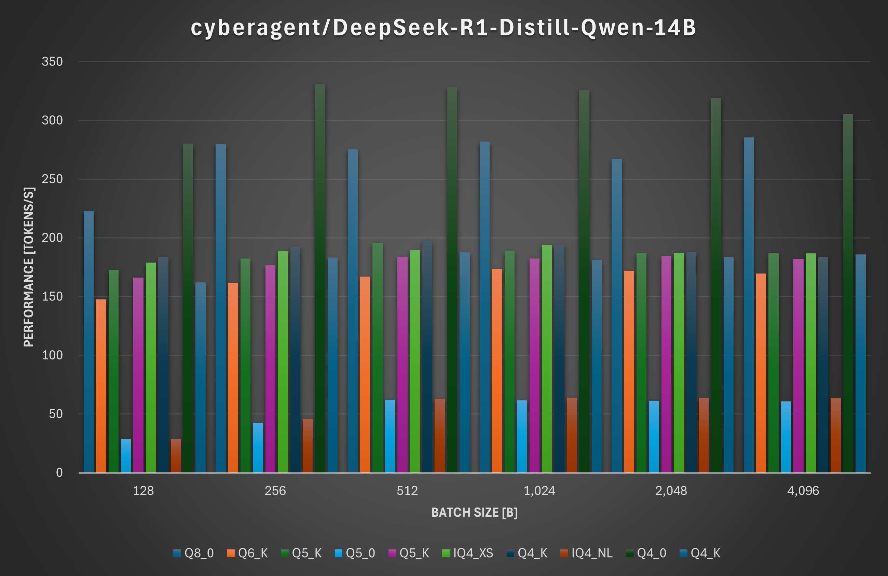

# **Benchmark test**

Measure performance using llama-bench provided by llama.cpp.
The models used for benchmarking are DeepSeek-R1-Distill-Qwen-14B and DeepSeek-R1-Distill-Qwen-32B.
The benchmarking environment is **Intel Xeon Platinum 8470(Sapphire Rapids)**.

## **DeepSeek-R1-Distill-Qwen-14B**

### Condition
   - Model : [DeepSeek-R1-Distill-Qwen-14B](https://huggingface.co/mmnga/DeepSeek-R1-Distill-Qwen-14B-gguf)
   - Quantization : Q8_0, Q6_K, Q5_K_S, Q5_0, Q5_K_M, IQ4_XS, Q4_K_S, IQ4_NL, Q4_0, Q4_K_M
   - Batch-size : 128, 256, 512, 1024, 2048, 4096
   - Flash attention : ON
### Result

  

## **DeepSeek-R1-Distill-Qwen-32B**

### Condition
   - Model : [DeepSeek-R1-Distill-Qwen-32B](https://huggingface.co/mmnga/DeepSeek-R1-Distill-Qwen-32B-gguf)
   - Quantization : Q8_0, Q6_K, Q5_K_S, Q5_0, Q5_K_M, IQ4_XS, Q4_K_S, IQ4_NL, Q4_0, Q4_K_M
   - Batch-size : 128, 256, 512, 1024, 2048, 4096
   - Flash attention : ON
### Result

  
