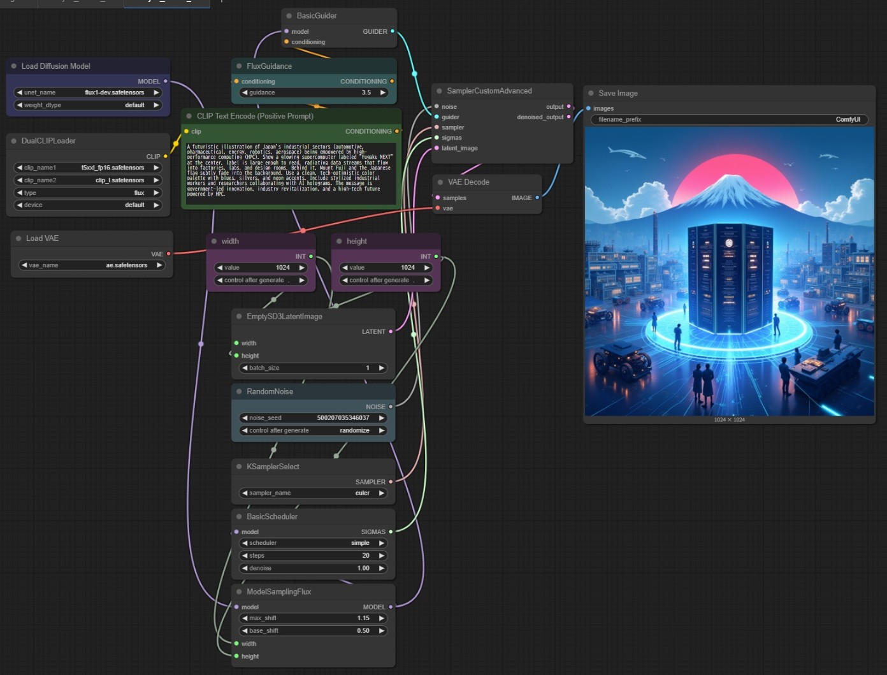
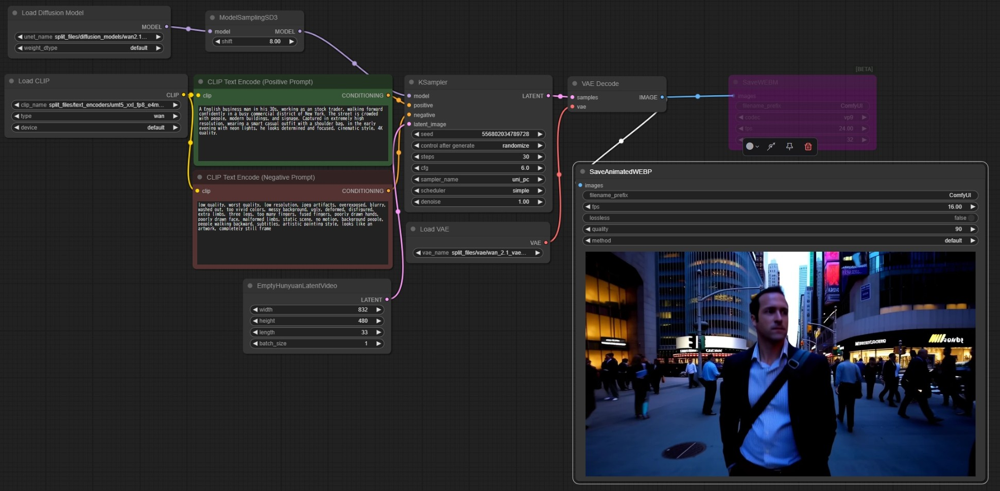

# Setup

## Directory Creation  
Models and image outputs used by ComfyUI are consolidated under the `ComfyUI` directory located in the home directory.
When using it for the first time, various subdirectories should be created under the `ComfyUI` directory.

```bash
BASE=$HOME/ComfyUI

DIR="$BASE/custom_nodes $BASE/models/unet $BASE/models/vae $BASE/models/text_encoders $BASE/models/clip $BASE/models/diffusion_models $BASE/models/checkpoints $BASE/input $BASE/output $BASE/temp $BASE/user"
for i in $DIR;do
  if [ ! -d "$i" ]; then
    mkdir -p "$i"
  fi
done
```


## Downloading Models and Other Files

When using ComfyUI for the first time, no necessary models or resources are available by default.
You will need to download the required files from Hugging Face.

The following script downloads the models for **FLUX1** (image generation) and **Wan2.1** (video generation) in one go.

```python
import os
from huggingface_hub import hf_hub_download

MODELS_TO_DOWNLOAD = [
    # FLUX1 text2image
    {
        "repo_id": "black-forest-labs/FLUX.1-dev",
        "filename": "flux1-dev.safetensors",
        "subdir": "unet"
    },
    {
        "repo_id": "black-forest-labs/FLUX.1-dev",
        "filename": "ae.safetensors",
        "subdir": "vae"
    },
    {
        "repo_id": "comfyanonymous/flux_text_encoders",
        "filename": "t5xxl_fp16.safetensors",
        "subdir": "text_encoders"
    },
    {
        "repo_id": "comfyanonymous/flux_text_encoders",
        "filename": "clip_l.safetensors",
        "subdir": "clip"
    },
    # Wan 2.1 video
    {
        "repo_id": "Comfy-Org/Wan_2.1_ComfyUI_repackaged",
        "filename": "split_files/text_encoders/umt5_xxl_fp8_e4m3fn_scaled.safetensors",
        "subdir": "text_encoders"
    },
    {
        "repo_id": "Comfy-Org/Wan_2.1_ComfyUI_repackaged",
        "filename": "split_files/vae/wan_2.1_vae.safetensors",
        "subdir": "vae"
    },
    {
        "repo_id": "Comfy-Org/Wan_2.1_ComfyUI_repackaged",
        "filename": "split_files/diffusion_models/wan2.1_t2v_1.3B_fp16.safetensors",
        "subdir": "diffusion_models"
    },
    {
        "repo_id": "Comfy-Org/Wan_2.1_ComfyUI_repackaged",
        "filename": "split_files/diffusion_models/wan2.1_t2v_14B_fp16.safetensors",
        "subdir": "diffusion_models"
    },
]

BASE_DIR = os.path.join(os.path.dirname(__file__), "ComfyUI", "models")

def download_model(repo_id, filename, subdir):
    try:
        target_dir = os.path.join(BASE_DIR, subdir)
        os.makedirs(target_dir, exist_ok=True)
        print(f"Downloading {filename} from {repo_id} -> {subdir}/")

        file_path = hf_hub_download(
            repo_id=repo_id,
            filename=filename,
            cache_dir=target_dir,
            local_dir=target_dir,
            local_dir_use_symlinks=False,
        )
        print(f"Done: {file_path}\n")
    except Exception as e:
        print(f"Error downloading {filename} from {repo_id}: {e}\n")

def main():
    print("=== ComfyUI Download Start ===\n")
    for model in MODELS_TO_DOWNLOAD:
        download_model(model["repo_id"], model["filename"], model["subdir"])
    print("=== Finished ===")


if __name__ == "__main__":
    main()
```

# Execution

## Starting the Singularity Container

When the Singularity container is started, the ComfyUI server is automatically launched and begins waiting for connections from a web browser.
```bash
singularity run --nv /path/to/ComfyUI.sif
```

## Connecting from a Web Browser

Accessing port **8188** on localhost will connect you to ComfyUI.
```
http://localhost:8188
```

# Sample

## Text-to-Image

By entering a prompt into the `"clip"` node and executing it, you can generate an image.
The more detailed your prompt, the more closely the output will match your intended image.



You can reproduce the workflow by dragging and dropping the image below directly into the ComfyUI interface:


## Text-to-Video

Enter your prompt for image generation into the `"clip"` under **Positive Prompt**, and specify elements you want to exclude under **Negative Prompt**. Executing this will generate a video. As with images, more detailed prompts produce results closer to your vision.



You can recreate the workflow by dragging and dropping the image below directly into the ComfyUI interface:


# Reference

The following site provides many examples of what can be generated with ComfyUI:

[ComfyUI Examples](https://comfyanonymous.github.io/ComfyUI_examples/)

