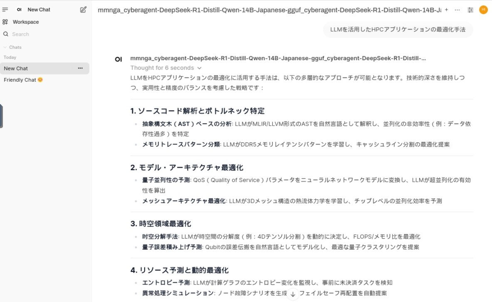

# **ChatGPT-like service: Open WebUI + llama.cpp**

Implement a ChatGPT-like service in a local environment using OpenWebUI fot UI and llama.cpp for inference with the large language model.
1. Install llama.cpp, uv and a large language model in a local environment, then start llama-server.
2. Start the OpenWebUI server in a local environment.
3. Launch a web browser in the local environment and connect to llama-server.

## **1. Start llama-server**

The necessary packages are installed in the Singularity container created with llama.cpp.def, so the container image should be pre-built with the name `llama.cpp.sif`.
Start the llama-server using the Singularity container.
- the number of layers to store in VRAM is 99
- port to listen is 1000
- enable Flash Attention
- LLM uses a model fine-tuned in Japanese by CyberAgent on deepseek-ai/DeepSeek-R1-Distill-Qwen-14B, and the 6-bit quantized model converted to the GGUF format by mmnga.
- Specify the path to llama.cpp.sif.

```bash
#!/bin/sh

cat << EOF > .server.sh
llama-server \
  --n-gpu-layers 99 \
  --port 10000 \
  --flash-attn  \
  -hf mmnga/cyberagent-DeepSeek-R1-Distill-Qwen-14B-Japanese-gguf:Q6_K
EOF

SIFFILE=/path/to/llama.cpp.sif
export SINGULARITY_BIND=/lvs0
singularity run --nv $SIFFILE sh ./.server.sh
```

## **2. Start OpenWebUI server**

Start the OpenWebUI server using the Singularity container.
- Python version is 3.10 in this container
- Specify the path to llama.cpp.sif.

```bash
#!/bin/sh

cat << EOF > .openwebui.sh
DATA_DIR=~/.open-webui /opt/uv/uvx --python 3.10 open-webui@latest serve
EOF

SIFFILE=/path/to/llama.cpp.sif
export SINGULARITY_BIND=/lvs0
singularity run --nv $SIFFILE sh ./.openwebui.sh
```

## **3. Generate responses with web browser**

Connect llama-server to OpenWebUI.
- Go to Admin Settings in Open WebUI.
- Navigate to Connections > OpenAI Connections.
- Add the following details for the new connection:
  - URL: http://127.0.0.1:10000/v1
  - API Key: none

  

You can now use Open WebUI’s chat interface to interact with the 

  

# **Benchmark test**

Measure performance using llama-bench provided by llama.cpp.
The models used for benchmarking are DeepSeek-R1-Distill-Qwen-14B and DeepSeek-R1-Distill-Qwen-32B.
The benchmarking environment is **NVIDIA GH200**.

## **DeepSeek-R1-Distill-Qwen-14B**

### Condition
   - Model : [DeepSeek-R1-Distill-Qwen-14B](https://huggingface.co/mmnga/DeepSeek-R1-Distill-Qwen-14B-gguf)
   - Quantization : Q8_0, Q6_K, Q5_K_S, Q5_0, Q5_K_M, IQ4_XS, Q4_K_S, IQ4_NL, Q4_0, Q4_K_M
   - Batch-size : 128, 256, 512, 1024, 2048, 4096
   - Flash attention : ON
### Result

| model                          |       size |     params | backend    | ngl | n_batch | fa |          test |                  t/s |
| ------------------------------ | ---------: | ---------: | ---------- | --: | ------: | -: | ------------: | -------------------: |
| qwen2 14B Q8_0                 |  14.62 GiB |    14.77 B | CUDA       |  99 |     128 |  1 |         pp512 |      3850.69 ± 12.14 |
| qwen2 14B Q8_0                 |  14.62 GiB |    14.77 B | CUDA       |  99 |     256 |  1 |         pp512 |       6332.85 ± 6.10 |
| qwen2 14B Q8_0                 |  14.62 GiB |    14.77 B | CUDA       |  99 |     512 |  1 |         pp512 |      9165.51 ± 15.87 |
| qwen2 14B Q8_0                 |  14.62 GiB |    14.77 B | CUDA       |  99 |    1024 |  1 |         pp512 |      9171.27 ± 15.91 |
| qwen2 14B Q8_0                 |  14.62 GiB |    14.77 B | CUDA       |  99 |    2048 |  1 |         pp512 |      9176.25 ± 17.58 |
| qwen2 14B Q8_0                 |  14.62 GiB |    14.77 B | CUDA       |  99 |    4096 |  1 |         pp512 |       9174.96 ± 9.12 |

| model                          |       size |     params | backend    | ngl | n_batch | fa |          test |                  t/s |
| ------------------------------ | ---------: | ---------: | ---------- | --: | ------: | -: | ------------: | -------------------: |
| qwen2 14B Q6_K                 |  11.29 GiB |    14.77 B | CUDA       |  99 |     128 |  1 |         pp512 |       2409.45 ± 1.79 |
| qwen2 14B Q6_K                 |  11.29 GiB |    14.77 B | CUDA       |  99 |     256 |  1 |         pp512 |       4227.88 ± 1.53 |
| qwen2 14B Q6_K                 |  11.29 GiB |    14.77 B | CUDA       |  99 |     512 |  1 |         pp512 |       6607.55 ± 6.05 |
| qwen2 14B Q6_K                 |  11.29 GiB |    14.77 B | CUDA       |  99 |    1024 |  1 |         pp512 |       6609.47 ± 3.38 |
| qwen2 14B Q6_K                 |  11.29 GiB |    14.77 B | CUDA       |  99 |    2048 |  1 |         pp512 |       6613.72 ± 4.91 |
| qwen2 14B Q6_K                 |  11.29 GiB |    14.77 B | CUDA       |  99 |    4096 |  1 |         pp512 |       6599.67 ± 3.34 |

| model                          |       size |     params | backend    | ngl | n_batch | fa |          test |                  t/s |
| ------------------------------ | ---------: | ---------: | ---------- | --: | ------: | -: | ------------: | -------------------: |
| qwen2 14B Q5_K - Small         |   9.56 GiB |    14.77 B | CUDA       |  99 |     128 |  1 |         pp512 |       2425.38 ± 2.16 |
| qwen2 14B Q5_K - Small         |   9.56 GiB |    14.77 B | CUDA       |  99 |     256 |  1 |         pp512 |       4285.08 ± 1.56 |
| qwen2 14B Q5_K - Small         |   9.56 GiB |    14.77 B | CUDA       |  99 |     512 |  1 |         pp512 |       6789.25 ± 5.89 |
| qwen2 14B Q5_K - Small         |   9.56 GiB |    14.77 B | CUDA       |  99 |    1024 |  1 |         pp512 |       6790.52 ± 3.12 |
| qwen2 14B Q5_K - Small         |   9.56 GiB |    14.77 B | CUDA       |  99 |    2048 |  1 |         pp512 |       6790.13 ± 3.87 |
| qwen2 14B Q5_K - Small         |   9.56 GiB |    14.77 B | CUDA       |  99 |    4096 |  1 |         pp512 |       6780.64 ± 3.73 |

| model                          |       size |     params | backend    | ngl | n_batch | fa |          test |                  t/s |
| ------------------------------ | ---------: | ---------: | ---------- | --: | ------: | -: | ------------: | -------------------: |
| qwen2 14B Q5_0                 |   9.56 GiB |    14.77 B | CUDA       |  99 |     128 |  1 |         pp512 |       2949.41 ± 1.59 |
| qwen2 14B Q5_0                 |   9.56 GiB |    14.77 B | CUDA       |  99 |     256 |  1 |         pp512 |       5057.86 ± 3.00 |
| qwen2 14B Q5_0                 |   9.56 GiB |    14.77 B | CUDA       |  99 |     512 |  1 |         pp512 |       7702.52 ± 3.51 |
| qwen2 14B Q5_0                 |   9.56 GiB |    14.77 B | CUDA       |  99 |    1024 |  1 |         pp512 |       7716.39 ± 3.61 |
| qwen2 14B Q5_0                 |   9.56 GiB |    14.77 B | CUDA       |  99 |    2048 |  1 |         pp512 |       7704.92 ± 0.99 |
| qwen2 14B Q5_0                 |   9.56 GiB |    14.77 B | CUDA       |  99 |    4096 |  1 |         pp512 |      7685.22 ± 60.83 |

| model                          |       size |     params | backend    | ngl | n_batch | fa |          test |                  t/s |
| ------------------------------ | ---------: | ---------: | ---------- | --: | ------: | -: | ------------: | -------------------: |
| qwen2 14B Q5_K - Medium        |   9.78 GiB |    14.77 B | CUDA       |  99 |     128 |  1 |         pp512 |       2408.29 ± 1.93 |
| qwen2 14B Q5_K - Medium        |   9.78 GiB |    14.77 B | CUDA       |  99 |     256 |  1 |         pp512 |       4264.11 ± 1.28 |
| qwen2 14B Q5_K - Medium        |   9.78 GiB |    14.77 B | CUDA       |  99 |     512 |  1 |         pp512 |       6771.51 ± 3.81 |
| qwen2 14B Q5_K - Medium        |   9.78 GiB |    14.77 B | CUDA       |  99 |    1024 |  1 |         pp512 |       6778.75 ± 1.33 |
| qwen2 14B Q5_K - Medium        |   9.78 GiB |    14.77 B | CUDA       |  99 |    2048 |  1 |         pp512 |       6779.16 ± 1.07 |
| qwen2 14B Q5_K - Medium        |   9.78 GiB |    14.77 B | CUDA       |  99 |    4096 |  1 |         pp512 |       6770.54 ± 1.22 |

| model                          |       size |     params | backend    | ngl | n_batch | fa |          test |                  t/s |
| ------------------------------ | ---------: | ---------: | ---------- | --: | ------: | -: | ------------: | -------------------: |
| qwen2 14B IQ4_XS - 4.25 bpw    |   7.56 GiB |    14.77 B | CUDA       |  99 |     128 |  1 |         pp512 |       2400.08 ± 0.69 |
| qwen2 14B IQ4_XS - 4.25 bpw    |   7.56 GiB |    14.77 B | CUDA       |  99 |     256 |  1 |         pp512 |       4247.59 ± 3.90 |
| qwen2 14B IQ4_XS - 4.25 bpw    |   7.56 GiB |    14.77 B | CUDA       |  99 |     512 |  1 |         pp512 |       6723.52 ± 2.16 |
| qwen2 14B IQ4_XS - 4.25 bpw    |   7.56 GiB |    14.77 B | CUDA       |  99 |    1024 |  1 |         pp512 |       6730.29 ± 1.59 |
| qwen2 14B IQ4_XS - 4.25 bpw    |   7.56 GiB |    14.77 B | CUDA       |  99 |    2048 |  1 |         pp512 |       6725.05 ± 0.82 |
| qwen2 14B IQ4_XS - 4.25 bpw    |   7.56 GiB |    14.77 B | CUDA       |  99 |    4096 |  1 |         pp512 |       6732.74 ± 1.99 |

| model                          |       size |     params | backend    | ngl | n_batch | fa |          test |                  t/s |
| ------------------------------ | ---------: | ---------: | ---------- | --: | ------: | -: | ------------: | -------------------: |
| qwen2 14B Q4_K - Small         |   7.98 GiB |    14.77 B | CUDA       |  99 |     128 |  1 |         pp512 |       2422.45 ± 0.98 |
| qwen2 14B Q4_K - Small         |   7.98 GiB |    14.77 B | CUDA       |  99 |     256 |  1 |         pp512 |       4287.35 ± 2.47 |
| qwen2 14B Q4_K - Small         |   7.98 GiB |    14.77 B | CUDA       |  99 |     512 |  1 |         pp512 |       6811.83 ± 2.14 |
| qwen2 14B Q4_K - Small         |   7.98 GiB |    14.77 B | CUDA       |  99 |    1024 |  1 |         pp512 |       6816.82 ± 1.40 |
| qwen2 14B Q4_K - Small         |   7.98 GiB |    14.77 B | CUDA       |  99 |    2048 |  1 |         pp512 |       6822.22 ± 1.89 |
| qwen2 14B Q4_K - Small         |   7.98 GiB |    14.77 B | CUDA       |  99 |    4096 |  1 |         pp512 |       6812.85 ± 4.29 |

| model                          |       size |     params | backend    | ngl | n_batch | fa |          test |                  t/s |
| ------------------------------ | ---------: | ---------: | ---------- | --: | ------: | -: | ------------: | -------------------: |
| qwen2 14B IQ4_NL - 4.5 bpw     |   7.96 GiB |    14.77 B | CUDA       |  99 |     128 |  1 |         pp512 |       2403.69 ± 0.98 |
| qwen2 14B IQ4_NL - 4.5 bpw     |   7.96 GiB |    14.77 B | CUDA       |  99 |     256 |  1 |         pp512 |      4235.04 ± 17.08 |
| qwen2 14B IQ4_NL - 4.5 bpw     |   7.96 GiB |    14.77 B | CUDA       |  99 |     512 |  1 |         pp512 |       6726.47 ± 3.76 |
| qwen2 14B IQ4_NL - 4.5 bpw     |   7.96 GiB |    14.77 B | CUDA       |  99 |    1024 |  1 |         pp512 |       6725.06 ± 2.03 |
| qwen2 14B IQ4_NL - 4.5 bpw     |   7.96 GiB |    14.77 B | CUDA       |  99 |    2048 |  1 |         pp512 |       6719.16 ± 3.77 |
| qwen2 14B IQ4_NL - 4.5 bpw     |   7.96 GiB |    14.77 B | CUDA       |  99 |    4096 |  1 |         pp512 |       6728.75 ± 0.74 |

| model                          |       size |     params | backend    | ngl | n_batch | fa |          test |                  t/s |
| ------------------------------ | ---------: | ---------: | ---------- | --: | ------: | -: | ------------: | -------------------: |
| qwen2 14B Q4_0                 |   7.93 GiB |    14.77 B | CUDA       |  99 |     128 |  1 |         pp512 |       2412.38 ± 0.64 |
| qwen2 14B Q4_0                 |   7.93 GiB |    14.77 B | CUDA       |  99 |     256 |  1 |         pp512 |       4262.64 ± 1.67 |
| qwen2 14B Q4_0                 |   7.93 GiB |    14.77 B | CUDA       |  99 |     512 |  1 |         pp512 |       6802.25 ± 2.48 |
| qwen2 14B Q4_0                 |   7.93 GiB |    14.77 B | CUDA       |  99 |    1024 |  1 |         pp512 |       6807.17 ± 1.41 |
| qwen2 14B Q4_0                 |   7.93 GiB |    14.77 B | CUDA       |  99 |    2048 |  1 |         pp512 |       6805.37 ± 3.77 |
| qwen2 14B Q4_0                 |   7.93 GiB |    14.77 B | CUDA       |  99 |    4096 |  1 |         pp512 |       6804.41 ± 0.73 |

| model                          |       size |     params | backend    | ngl | n_batch | fa |          test |                  t/s |
| ------------------------------ | ---------: | ---------: | ---------- | --: | ------: | -: | ------------: | -------------------: |
| qwen2 14B Q4_K - Medium        |   8.37 GiB |    14.77 B | CUDA       |  99 |     128 |  1 |         pp512 |       2421.30 ± 0.18 |
| qwen2 14B Q4_K - Medium        |   8.37 GiB |    14.77 B | CUDA       |  99 |     256 |  1 |         pp512 |       4291.09 ± 2.00 |
| qwen2 14B Q4_K - Medium        |   8.37 GiB |    14.77 B | CUDA       |  99 |     512 |  1 |         pp512 |       6815.02 ± 3.97 |
| qwen2 14B Q4_K - Medium        |   8.37 GiB |    14.77 B | CUDA       |  99 |    1024 |  1 |         pp512 |       6817.43 ± 0.83 |
| qwen2 14B Q4_K - Medium        |   8.37 GiB |    14.77 B | CUDA       |  99 |    2048 |  1 |         pp512 |       6818.08 ± 1.21 |
| qwen2 14B Q4_K - Medium        |   8.37 GiB |    14.77 B | CUDA       |  99 |    4096 |  1 |         pp512 |       6817.81 ± 1.70 |

## **DeepSeek-R1-Distill-Qwen-32B**

### Condition
   - Model : [DeepSeek-R1-Distill-Qwen-32B](https://huggingface.co/mmnga/DeepSeek-R1-Distill-Qwen-32B-gguf)
   - Quantization : Q8_0, Q6_K, Q5_K_S, Q5_0, Q5_K_M, IQ4_XS, Q4_K_S, IQ4_NL, Q4_0, Q4_K_M
   - Batch-size : 128, 256, 512, 1024, 2048, 4096
   - Flash attention : ON
### Result

| model                          |       size |     params | backend    | ngl | n_batch | fa |          test |                  t/s |
| ------------------------------ | ---------: | ---------: | ---------- | --: | ------: | -: | ------------: | -------------------: |
| qwen2 32B Q8_0                 |  32.42 GiB |    32.76 B | CUDA       |  99 |     128 |  1 |         pp512 |       1968.61 ± 0.69 |
| qwen2 32B Q8_0                 |  32.42 GiB |    32.76 B | CUDA       |  99 |     256 |  1 |         pp512 |       3264.10 ± 1.38 |
| qwen2 32B Q8_0                 |  32.42 GiB |    32.76 B | CUDA       |  99 |     512 |  1 |         pp512 |       4604.70 ± 0.29 |
| qwen2 32B Q8_0                 |  32.42 GiB |    32.76 B | CUDA       |  99 |    1024 |  1 |         pp512 |       4615.04 ± 2.49 |
| qwen2 32B Q8_0                 |  32.42 GiB |    32.76 B | CUDA       |  99 |    2048 |  1 |         pp512 |       4615.00 ± 3.13 |
| qwen2 32B Q8_0                 |  32.42 GiB |    32.76 B | CUDA       |  99 |    4096 |  1 |         pp512 |       4610.16 ± 3.88 |

| model                          |       size |     params | backend    | ngl | n_batch | fa |          test |                  t/s |
| ------------------------------ | ---------: | ---------: | ---------- | --: | ------: | -: | ------------: | -------------------: |
| qwen2 32B Q6_K                 |  25.03 GiB |    32.76 B | CUDA       |  99 |     128 |  1 |         pp512 |       1145.83 ± 0.15 |
| qwen2 32B Q6_K                 |  25.03 GiB |    32.76 B | CUDA       |  99 |     256 |  1 |         pp512 |       2042.20 ± 0.17 |
| qwen2 32B Q6_K                 |  25.03 GiB |    32.76 B | CUDA       |  99 |     512 |  1 |         pp512 |       3207.89 ± 1.89 |
| qwen2 32B Q6_K                 |  25.03 GiB |    32.76 B | CUDA       |  99 |    1024 |  1 |         pp512 |       3208.04 ± 1.39 |
| qwen2 32B Q6_K                 |  25.03 GiB |    32.76 B | CUDA       |  99 |    2048 |  1 |         pp512 |       3207.45 ± 1.39 |
| qwen2 32B Q6_K                 |  25.03 GiB |    32.76 B | CUDA       |  99 |    4096 |  1 |         pp512 |       3210.03 ± 1.16 |

| model                          |       size |     params | backend    | ngl | n_batch | fa |          test |                  t/s |
| ------------------------------ | ---------: | ---------: | ---------- | --: | ------: | -: | ------------: | -------------------: |
| qwen2 32B Q5_K - Small         |  21.08 GiB |    32.76 B | CUDA       |  99 |     128 |  1 |         pp512 |       1144.95 ± 0.09 |
| qwen2 32B Q5_K - Small         |  21.08 GiB |    32.76 B | CUDA       |  99 |     256 |  1 |         pp512 |       2048.55 ± 0.45 |
| qwen2 32B Q5_K - Small         |  21.08 GiB |    32.76 B | CUDA       |  99 |     512 |  1 |         pp512 |       3242.08 ± 1.26 |
| qwen2 32B Q5_K - Small         |  21.08 GiB |    32.76 B | CUDA       |  99 |    1024 |  1 |         pp512 |       3240.29 ± 1.42 |
| qwen2 32B Q5_K - Small         |  21.08 GiB |    32.76 B | CUDA       |  99 |    2048 |  1 |         pp512 |       3242.41 ± 0.40 |
| qwen2 32B Q5_K - Small         |  21.08 GiB |    32.76 B | CUDA       |  99 |    4096 |  1 |         pp512 |       3240.02 ± 1.25 |

| model                          |       size |     params | backend    | ngl | n_batch | fa |          test |                  t/s |
| ------------------------------ | ---------: | ---------: | ---------- | --: | ------: | -: | ------------: | -------------------: |
| qwen2 32B Q5_0                 |  21.08 GiB |    32.76 B | CUDA       |  99 |     128 |  1 |         pp512 |       1440.71 ± 0.28 |
| qwen2 32B Q5_0                 |  21.08 GiB |    32.76 B | CUDA       |  99 |     256 |  1 |         pp512 |       2508.22 ± 0.99 |
| qwen2 32B Q5_0                 |  21.08 GiB |    32.76 B | CUDA       |  99 |     512 |  1 |         pp512 |       3792.20 ± 0.76 |
| qwen2 32B Q5_0                 |  21.08 GiB |    32.76 B | CUDA       |  99 |    1024 |  1 |         pp512 |       3783.56 ± 2.26 |
| qwen2 32B Q5_0                 |  21.08 GiB |    32.76 B | CUDA       |  99 |    2048 |  1 |         pp512 |       3787.48 ± 1.62 |
| qwen2 32B Q5_0                 |  21.08 GiB |    32.76 B | CUDA       |  99 |    4096 |  1 |         pp512 |       3786.54 ± 0.83 |

| model                          |       size |     params | backend    | ngl | n_batch | fa |          test |                  t/s |
| ------------------------------ | ---------: | ---------: | ---------- | --: | ------: | -: | ------------: | -------------------: |
| qwen2 32B Q5_K - Medium        |  21.66 GiB |    32.76 B | CUDA       |  99 |     128 |  1 |         pp512 |       1145.92 ± 0.08 |
| qwen2 32B Q5_K - Medium        |  21.66 GiB |    32.76 B | CUDA       |  99 |     256 |  1 |         pp512 |       2049.72 ± 0.11 |
| qwen2 32B Q5_K - Medium        |  21.66 GiB |    32.76 B | CUDA       |  99 |     512 |  1 |         pp512 |       3243.56 ± 0.89 |
| qwen2 32B Q5_K - Medium        |  21.66 GiB |    32.76 B | CUDA       |  99 |    1024 |  1 |         pp512 |       3243.90 ± 1.00 |
| qwen2 32B Q5_K - Medium        |  21.66 GiB |    32.76 B | CUDA       |  99 |    2048 |  1 |         pp512 |       3243.10 ± 0.32 |
| qwen2 32B Q5_K - Medium        |  21.66 GiB |    32.76 B | CUDA       |  99 |    4096 |  1 |         pp512 |       3243.49 ± 0.43 |

| model                          |       size |     params | backend    | ngl | n_batch | fa |          test |                  t/s |
| ------------------------------ | ---------: | ---------: | ---------- | --: | ------: | -: | ------------: | -------------------: |
| qwen2 32B IQ4_XS - 4.25 bpw    |  16.47 GiB |    32.76 B | CUDA       |  99 |     128 |  1 |         pp512 |       1144.43 ± 0.10 |
| qwen2 32B IQ4_XS - 4.25 bpw    |  16.47 GiB |    32.76 B | CUDA       |  99 |     256 |  1 |         pp512 |       2043.50 ± 0.70 |
| qwen2 32B IQ4_XS - 4.25 bpw    |  16.47 GiB |    32.76 B | CUDA       |  99 |     512 |  1 |         pp512 |       3227.57 ± 0.89 |
| qwen2 32B IQ4_XS - 4.25 bpw    |  16.47 GiB |    32.76 B | CUDA       |  99 |    1024 |  1 |         pp512 |       3229.74 ± 1.44 |
| qwen2 32B IQ4_XS - 4.25 bpw    |  16.47 GiB |    32.76 B | CUDA       |  99 |    2048 |  1 |         pp512 |       3231.04 ± 0.99 |
| qwen2 32B IQ4_XS - 4.25 bpw    |  16.47 GiB |    32.76 B | CUDA       |  99 |    4096 |  1 |         pp512 |       3229.46 ± 2.12 |
