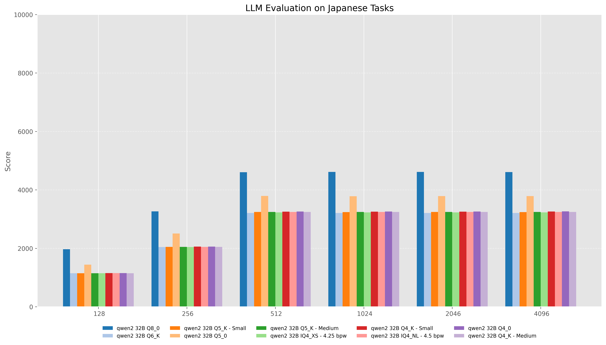
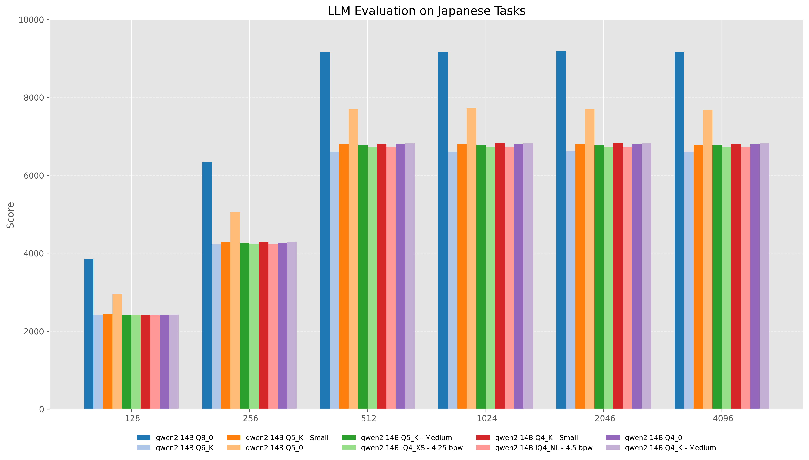
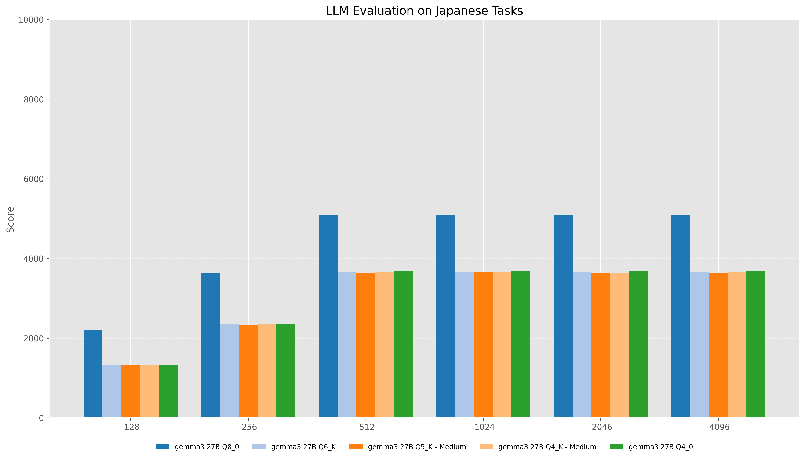

# **Benchmark test**

Measure performance using llama-bench provided by llama.cpp.
The models used for benchmarking are DeepSeek-R1-Distill-Qwen-14B and DeepSeek-R1-Distill-Qwen-32B.
The benchmarking environment is **NVIDIA GH200**.

## **DeepSeek-R1-Distill-Qwen-32B**

### Condition
   - Model : [mmnga/cyberagent-DeepSeek-R1-Distill-Qwen-32B-Japanese-gguf](https://huggingface.co/mmnga/cyberagent-DeepSeek-R1-Distill-Qwen-32B-Japanese-gguf)
   - Quantization : Q8_0, Q6_K, Q5_K_S, Q5_0, Q5_K_M, IQ4_XS, Q4_K_S, IQ4_NL, Q4_0, Q4_K_M
   - Batch-size : 128, 256, 512, 1024, 2048, 4096
   - Flash attention : ON
### Result

  

## **DeepSeek-R1-Distill-Qwen-14B**

### Condition
   - Model : [mmnga/cyberagent-DeepSeek-R1-Distill-Qwen-14B-Japanese-gguf](https://huggingface.co/mmnga/cyberagent-DeepSeek-R1-Distill-Qwen-14B-Japanese-gguf)
   - Quantization : Q8_0, Q6_K, Q5_K_S, Q5_0, Q5_K_M, IQ4_XS, Q4_K_S, IQ4_NL, Q4_0, Q4_K_M
   - Batch-size : 128, 256, 512, 1024, 2048, 4096
   - Flash attention : ON
### Result

  

## **unsloth/gemma-3-27b-it-GGUF**

### Condition
   - Model : [unsloth/gemma-3-27b-it-GGUF](https://huggingface.co/unsloth/gemma-3-27b-it-GGUF)
   - Quantization : Q8_0, Q6_K, Q5_K_M, Q4_K_M
   - Batch-size : 128, 256, 512, 1024, 2048, 4096
   - Flash attention : ON
### Result

  
