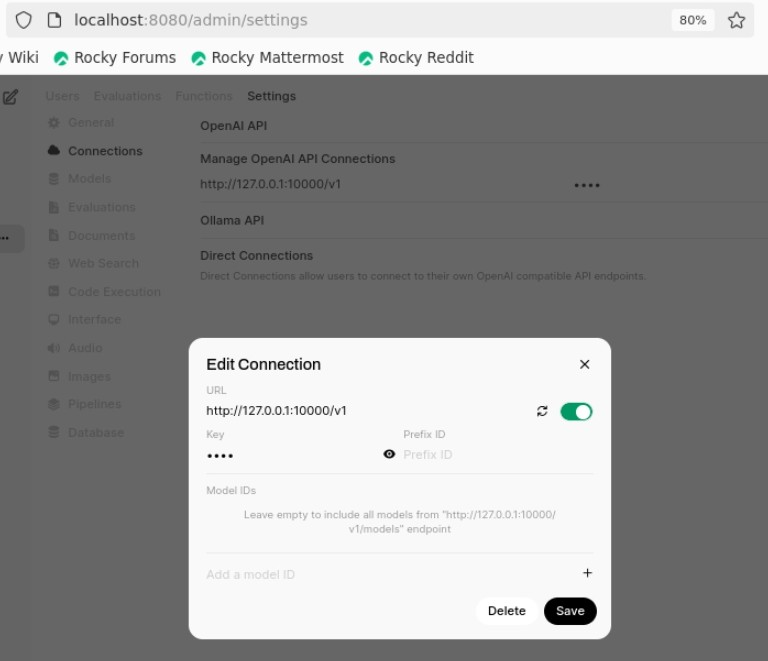

# **ChatGPT-like service: Open WebUI + llama.cpp**

Implement a ChatGPT-like service in a local environment using OpenWebUI fot UI and llama.cpp for inference with the large language model.
1. Install llama.cpp, uv and a large language model in a local environment, then start llama-server.
2. Start the OpenWebUI server in a local environment.
3. Launch a web browser in the local environment and connect to llama-server.

## **1. Start llama-server**

The necessary packages are installed in the Singularity container created with llama.cpp.def, so the container image should be pre-built with the name `llama.cpp.sif`.
Start the llama-server using the Singularity container.
- the number of layers to store in VRAM is 99
- port to listen is 1000
- enable Flash Attention
- LLM uses a model fine-tuned in Japanese by CyberAgent on deepseek-ai/DeepSeek-R1-Distill-Qwen-14B, and the 6-bit quantized model converted to the GGUF format by mmnga.
- Specify the path to llama.cpp.sif.

```bash
#!/bin/sh

cat << EOF > .server.sh
llama-server \
  --n-gpu-layers 99 \
  --port 10000 \
  --flash-attn  \
  -hf mmnga/cyberagent-DeepSeek-R1-Distill-Qwen-14B-Japanese-gguf:Q6_K
EOF

SIFFILE=/path/to/llama.cpp.sif
export SINGULARITY_BIND=/lvs0
singularity run --nv $SIFFILE sh ./.server.sh
```

## **2. Start OpenWebUI server**

Start the OpenWebUI server using the Singularity container.
- Python version is 3.10 in this container
- Specify the path to llama.cpp.sif.

```bash
#!/bin/sh

cat << EOF > .openwebui.sh
DATA_DIR=~/.open-webui /opt/uv/uvx --python 3.10 open-webui@latest serve
EOF

SIFFILE=/path/to/llama.cpp.sif
export SINGULARITY_BIND=/lvs0
singularity run --nv $SIFFILE sh ./.openwebui.sh
```

## **3. Generate responses with web browser**

Connect llama-server to OpenWebUI.
- Go to Admin Settings in Open WebUI.
- Navigate to Connections > OpenAI Connections.
- Add the following details for the new connection:
  - URL: http://127.0.0.1:10000/v1
  - API Key: none

  

You can now use Open WebUI’s chat interface to interact with the 

  

# **Benchmark test**

Measure performance using llama-bench provided by llama.cpp.
The models used for benchmarking are DeepSeek-R1-Distill-Qwen-14B and DeepSeek-R1-Distill-Qwen-32B.
The benchmarking environment is **NVIDIA GH200**.

## **DeepSeek-R1-Distill-Qwen-14B**

### Condition
   - Model : [DeepSeek-R1-Distill-Qwen-14B](https://huggingface.co/mmnga/DeepSeek-R1-Distill-Qwen-14B-gguf)
   - Quantization : Q8_0, Q6_K, Q5_K_S, Q5_0, Q5_K_M, IQ4_XS, Q4_K_S, IQ4_NL, Q4_0, Q4_K_M
   - Batch-size : 128, 256, 512, 1024, 2048, 4096
   - Flash attention : ON
### Result

  

## **DeepSeek-R1-Distill-Qwen-32B**

### Condition
   - Model : [DeepSeek-R1-Distill-Qwen-32B](https://huggingface.co/mmnga/DeepSeek-R1-Distill-Qwen-32B-gguf)
   - Quantization : Q8_0, Q6_K, Q5_K_S, Q5_0, Q5_K_M, IQ4_XS, Q4_K_S, IQ4_NL, Q4_0, Q4_K_M
   - Batch-size : 128, 256, 512, 1024, 2048, 4096
   - Flash attention : ON
### Result

  
