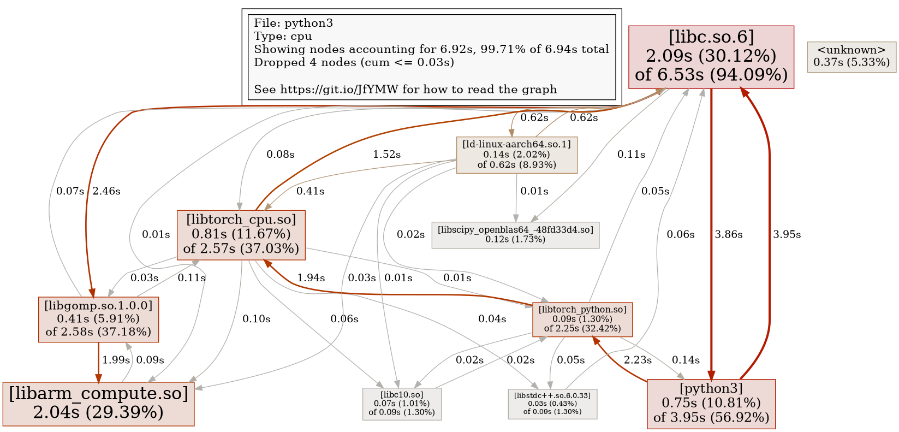

# **Benchmark test**

## **definition file**

Install Ubuntu standard packages and scons.
Set the installed gcc-14 and g++-14 as the default compilers.

```bash
  apt-get update && apt-get install -y --no-install-recommends build-essential
  apt-get install -y python3-dev python3-pip python3-pkgconfig python3-venv libhdf5-dev
  apt-get install -y gcc-14 g++-14
  apt-get install -y openmpi-bin openmpi-common openmpi-doc libopenmpi-dev libopenmpi3t64
  apt-get install -y wget git patchelf unzip cmake
  apt-get install -y libgoogle-perftools4t64

  update-alternatives --install /usr/bin/gcc gcc /usr/bin/gcc-14 100
  update-alternatives --install /usr/bin/g++ g++ /usr/bin/g++-14 100

  gcc --version
  g++ --version

  python3 -m pip install --break-system-packages scons
```

Clone the Arm Compute Library (ACL) source code from Git and checkout release **25.02.1**.
Release **25.02.1** includes stateless support for GEMM kernels, which improves performance.
Install ACL with neon, openmp, multi_isa, and fixed_format_kernels enabled.

```bash
  # Build Arm Compute Library (ACL)
  ACL_VER=25.02.1
  cd /opt
  git clone https://github.com/ARM-software/ComputeLibrary.git
  cd ComputeLibrary
  git checkout v${ACL_VER}
  scons Werror=0 -j32 benchmark_tests=1 embed_kernels=0 debug=0 neon=1 opencl=0 os=linux openmp=1 cppthreads=0 arch=armv8.2-a multi_isa=1 build=native fixed_format_kernels=1
```

Clone the OpenBLAS source code from Git and checkout release **0.3.27**.
OpenBLAS improves performance for GEMM kernels where ACL is not utilized.
Install OpenBLAS with openmp enabled.

```bash
  # Build OpenBLAS
  OB_VER=0.3.27
  cd /opt
  git clone https://github.com/OpenMathLib/OpenBLAS.git
  cd OpenBLAS
  git checkout v${OB_VER}
  mkdir build
  cd build
  cmake -DUSE_OPENMP=ON -DCORE=ARMV8SVE -DTARGET=ARMV8_2 ..
  make -j32
  make install
  rm -rf /opt/OpenBLAS
```

Define the root directory of ACL and the use of MKLDNN, MKLDNN_ACL, MPI, and OpenMP for PyTorch installation.

```bash
  export ACL_ROOT_DIR=/opt/ComputeLibrary
  export USE_MKL=ON USE_MKLDNN=ON USE_MKLDNN_ACL=ON USE_CUDA=0 USE_MPI=1 USE_OPENMP=1
```

Create the `/opt/dist` directory to store the wheels that will be built later.

```bash
  mkdir /opt/dist
```

Clone the PyTorch source from Git and checkout release **2.5.0**.
Also, checkout release **3.7.1** of oneDNN.
Create a wheel according to the above declarations, move the wheel file to `/opt/dist`, and install it.
To reduce the container file size, delete the cloned directories.

```bash
  # Build PyTorch from the tip of the tree
  PYTORCH_VER=2.5.0
  ONEDNN_VER=3.7.1
  cd /opt
  git clone --recursive http://github.com/pytorch/pytorch
  cd pytorch
  git checkout v${PYTORCH_VER}
  git submodule sync
  git submodule update --init --recursive
  cd third_party/ideep/mkl-dnn
  git checkout v${ONEDNN_VER}
  cd ../../..
  python3 -m pip install --break-system-packages -r requirements.txt
  python3 setup.py bdist_wheel
  FILE=`cd ./dist; ls -1 *.whl | head -1`
  mv ./dist/${FILE} /opt/dist
  python3 -m pip install --break-system-packages /opt/dist/${FILE}
  cd /opt; rm -rf /opt/pytorch
```

Clone the source of TorchVision and TorchAudio from Git.
Create a wheel, move the wheel file to `/opt/dist`, and install it.
To reduce the container file size, delete the cloned directories.

```bash
  # Build TorchVision
  cd /opt
  git clone https://github.com/pytorch/vision
  cd vision
  python3 setup.py bdist_wheel
  FILE=`cd ./dist; ls -1 *.whl | head -1`
  mv ./dist/${FILE} /opt/dist
  python3 -m pip install --break-system-packages /opt/dist/${FILE}
  cd /opt; rm -rf /opt/vision

  # Build TorchAudio
  cd /opt
  git clone https://github.com/pytorch/audio
  cd audio
  python3 setup.py bdist_wheel
  FILE=`cd ./dist; ls -1 *.whl | head -1`
  mv ./dist/${FILE} /opt/dist
  python3 -m pip install --break-system-packages /opt/dist/${FILE}
  cd /opt; rm -rf /opt/audio
```

Freeze the environment for the reuse of the PyTorch environment.

```bash
  python3 -m pip freeze > /opt/requirements.txt
```

## Package List

The container created on May 9, 2025, for Graviton3E contains the following packages.

```
Package            Version
------------------ ------------------
astunparse         1.6.3
attrs              25.1.0
certifi            2025.1.31
charset-normalizer 3.4.1
expecttest         0.3.0
filelock           3.17.0
fsspec             2025.3.0
hypothesis         6.127.9
idna               3.10
Jinja2             3.1.6
lintrunner         0.12.7
MarkupSafe         3.0.2
mpmath             1.3.0
networkx           3.4.2
ninja              1.11.1.3
numpy              2.2.3
optree             0.14.1
packaging          24.2
pillow             11.1.0
pip                24.0
pkgconfig          1.5.5
psutil             7.0.0
PyYAML             6.0.2
requests           2.32.3
SCons              4.9.0
setuptools         68.1.2
six                1.17.0
sortedcontainers   2.4.0
sympy              1.13.1
torch              2.5.0a0+git32f585d
torchaudio         2.6.0a0+c670ad8
torchvision        0.22.0a0+124dfa4
types-dataclasses  0.6.6
typing_extensions  4.12.2
urllib3            2.3.0
wheel              0.42.0
```

# **Performance test**

## **MATMUL**

Measure the execution time of matrix multiplication for a 1000x1000 matrix.
Theoretical flop count is **200G flops**.

```python
import torch
import time

def benchmark_matmul():
    x = torch.randn(1000, 1000)
    y = torch.randn(1000, 1000)
    start = time.time()
    for _ in range(100):
        z = torch.matmul(x, y)
    end = time.time()
    print(f"Execution time: {end - start:.5f} seconds")

benchmark_matmul()
```

**The execution time at Graviton3E(hpc7g.16xlarge) using 64vCPU**

> note: tcmalloc refers to pre-loadiing libtcmalloc.so.4 befor python3.

| Mode | Execution time[sec] | GFlop/s |
| ---- | ----: | ----: |
| FP32 | 0.2069 | 966.9 |
| FP32+tcmalloc | 0.2070 | 966.1 |
| BF16 | 0.2069 | 966.5 |
| BF16+tcmalloc | 0.2070 | 966.1 |


## **INFERENCE**

### **Execution time**

- This script is quoted from the [PyTorch tutorial](https://pytorch.org/tutorials/recipes/inference_tuning_on_aws_graviton.html).

```python
import torch
import torch.nn as nn
from torch.profiler import profile, record_function, ProfilerActivity

device = ("cpu")
print(f"Using {device} device")

class MyNeuralNetwork(nn.Module):
  def __init__(self):
      super().__init__()
      self.flatten = nn.Flatten()
      self.linear_relu_stack = nn.Sequential(
          nn.Linear(4096, 4096),
          nn.ReLU(),
          nn.Linear(4096, 11008),
          nn.ReLU(),
          nn.Linear(11008, 10),
      )

  def forward(self, x):
      x = self.flatten(x)
      logits = self.linear_relu_stack(x)
      return logits

model = MyNeuralNetwork().to(device)

X = torch.rand(256, 64, 64, device=device)

with torch.set_grad_enabled(False):
    for _ in range(50):
        model(X) #Warmup
    with profile(activities=[ProfilerActivity.CPU]) as prof:
        with record_function("mymodel_inference"):
            for _ in range(100):
                model(X)

print(prof.key_averages().table(sort_by="self_cpu_time_total"))
```

- **The execution time at Graviton3E(hpc7g.16xlarge) using 64vCPU**

| Mode | Execution time[sec] |
| ---- | ----: |
| FP32 | 2.126 |
| FP32+tcmalloc | 1.018 |
| BF16 | 1.234 |
| BF16+tcmalloc | 0.667 |

### **Performance tool output**

- **torch.profiler output with the default PyTorch configuration(FP32)**

```
Using cpu device
----------------------  ------------  ------------  ------------  ------------  ------------  ------------
                  Name    Self CPU %      Self CPU   CPU total %     CPU total  CPU time avg    # of Calls
----------------------  ------------  ------------  ------------  ------------  ------------  ------------
           aten::addmm        92.84%        1.974s        94.32%        2.005s       6.684ms           300
       aten::clamp_min         2.93%      62.230ms         2.93%      62.230ms     311.149us           200
     mymodel_inference         2.29%      48.739ms       100.00%        2.126s        2.126s             1
           aten::copy_         1.43%      30.373ms         1.43%      30.373ms     101.243us           300
          aten::linear         0.10%       2.214ms        94.64%        2.012s       6.707ms           300
               aten::t         0.09%       2.019ms         0.22%       4.589ms      15.295us           300
            aten::relu         0.07%       1.553ms         3.00%      63.783ms     318.915us           200
      aten::as_strided         0.07%       1.449ms         0.07%       1.449ms       2.415us           600
       aten::transpose         0.06%       1.368ms         0.12%       2.569ms       8.564us           300
            aten::view         0.04%     855.499us         0.04%     855.499us       8.555us           100
          aten::expand         0.03%     642.560us         0.04%     890.680us       2.969us           300
         aten::flatten         0.02%     485.983us         0.06%       1.341ms      13.415us           100
    aten::resolve_conj         0.01%     258.197us         0.01%     258.197us       0.430us           600
----------------------  ------------  ------------  ------------  ------------  ------------  ------------
Self CPU time total: 2.126s
```

- **cProfile output with the default PyTorch configuration(FP32)**

  cProfile shows Python-level functions, while torch.profiler provides details of lower-level `aten::` functions. 
  Therefore, cProfile’s `torch._C._nn.linear` is actually broken down into multiple functions like `aten::linear`, `aten::addmm`, `aten::copy_`, and others in torch.profiler.
  For precise performance analysis, torch.profiler provides more detailed information.

```
Using cpu device
         5301 function calls (3901 primitive calls) in 2.138 seconds

   Ordered by: internal time
   List reduced from 18 to 10 due to restriction <10>

   ncalls  tottime  percall  cumtime  percall filename:lineno(function)
      300    2.026    0.007    2.026    0.007 {built-in method torch._C._nn.linear}
      200    0.064    0.000    0.064    0.000 {built-in method torch.relu}
      100    0.031    0.000    2.132    0.021 /usr/local/lib/python3.12/dist-packages/torch/nn/modules/container.py:248(forward)
  800/100    0.004    0.000    2.137    0.021 /usr/local/lib/python3.12/dist-packages/torch/nn/modules/module.py:1740(_call_impl)
  800/100    0.003    0.000    2.138    0.021 /usr/local/lib/python3.12/dist-packages/torch/nn/modules/module.py:1732(_wrapped_call_impl)
      800    0.002    0.000    0.002    0.000 {built-in method torch._C._get_tracing_state}
      100    0.002    0.000    0.002    0.000 {method 'flatten' of 'torch._C.TensorBase' objects}
      800    0.001    0.000    0.001    0.000 /usr/local/lib/python3.12/dist-packages/torch/nn/modules/module.py:1918(__getattr__)
      300    0.001    0.000    2.027    0.007 /usr/local/lib/python3.12/dist-packages/torch/nn/modules/linear.py:124(forward)
      200    0.001    0.000    0.066    0.000 /usr/local/lib/python3.12/dist-packages/torch/nn/modules/activation.py:132(forward)
```

- **Call graph by gperftools with the default PyTorch configuration(FP32)**

  It is possible to profile with gperftools by preloading libprofiler. 
  However, since gperftools is a tool designed for applications written in C/C++ and similar languages, the information that can be measured is limited. 
  The following call graph is the output of gperftools, but it only tracks the call structure of shared libraries.

  > LD_PRELOAD=/usr/lib/aarch64-linux-gnu/libprofiler.so.0 python3 infer.py  
  > /usr/local/go/pkg/tool/linux_arm64/pprof -png /usr/bin/python3 output.prof

  
