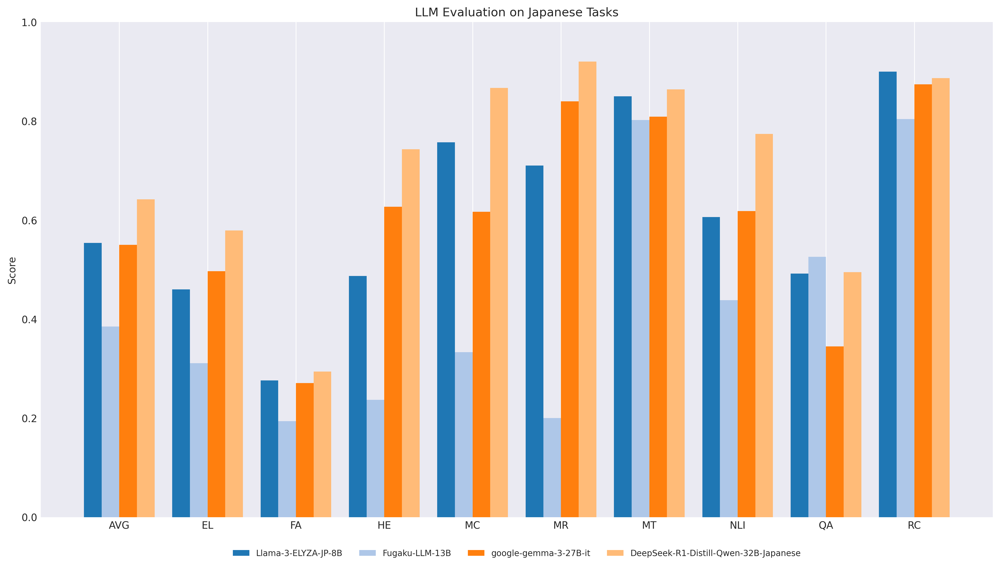
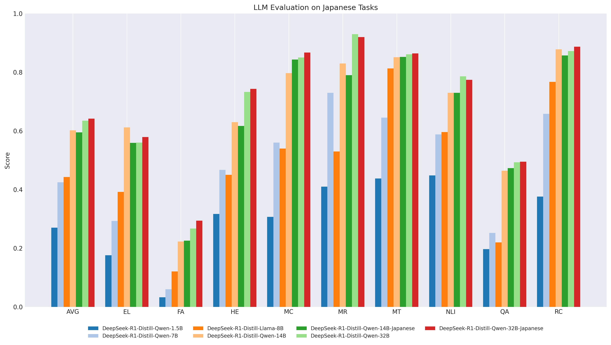
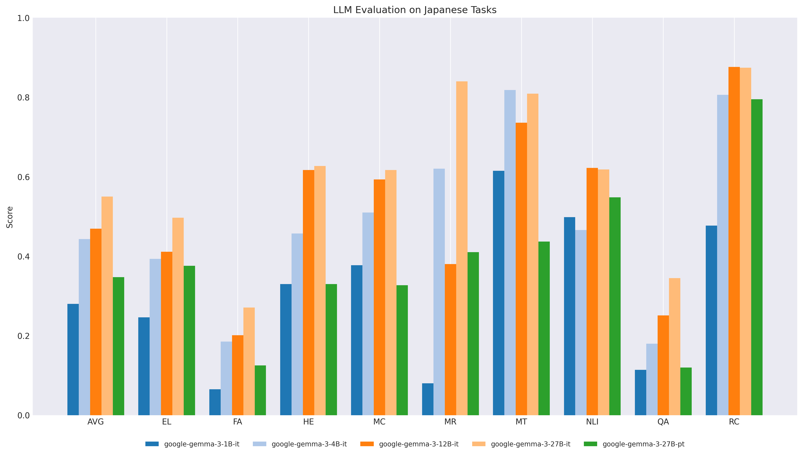

# **LLM evaluation result**

Evaluate the capabilities of the LLM through benchmark testing.

## **llm-jp-eval**

[llm-jp-eval](https://github.com/llm-jp/llm-jp-eval) is a benchmark developed under the [LLM-jp](https://llm-jp.nii.ac.jp) project led by the National Institute of Informatics (NII). 
It automatically evaluates Japanese LLMs across multiple datasets.

> [LLM-jp: A Cross-organizational Project for the Research and Development of Fully Open Japanese LLMs](https://arxiv.org/html/2407.03963v1)  
> [llm-jp-eval: 日本語大規模言語モデルの自動評価ツール](https://www.anlp.jp/proceedings/annual_meeting/2024/pdf_dir/A8-2.pdf)

| Category | Task | Dataset |
| ---- | ---- | ---- |
| EL | Entity linking | chABSA |
| FA | Reading prediction, Named entity recognition, Dependency parsing,   Predicate-argument structure analysis, Coreference resolution | Wikipedia Annotated Corpus |
| HE | Human examination | MMLU, JMMLU |
| MC | Multiple choice question answering | JCommonsenseQA |
| MR | Mathematical reasoning | MAWPS |
| MT | Mathematical translation | ALT Parallel Corpus, Wikipedia’s Kyoto Articles |
| NLI | Natural language inference | Jamp, JaNLI, JNLI, JSeM, JSICK |
| QA | Question answering | JEMHopQA, NIILC |
| RC | Reading comprehension | JSQuAD |

### Condition
  - Site : NVIDIA GH200, GraceCPU(72 ARM Neoverse V2 cores), H100 Tensor Core GPU
  - Singularity Container : [llm-jp-eval](https://github.com/RIKEN-RCCS/singularity_defpack/tree/main/gpu_nvidia/llm-jp-eval) which contains CUDA Version 12.4 and PyTorch Version 2.4.0a0+07cecf4

### Result

> [llm-jp/open-japanese-llm-leaderboard](https://huggingface.co/spaces/llm-jp/open-japanese-llm-leaderboard)

  - **Best result for each models**
  

  - **cyberagent-DeepSeek-R1-Distill**
  

  - **gemma-3**
  

> [Score for all models](https://github.com/RIKEN-RCCS/singularity_defpack/blob/main/gpu_nvidia/llm-jp-eval/all_score.csv)  
> [Best score for each models](https://github.com/RIKEN-RCCS/singularity_defpack/blob/main/gpu_nvidia/llm-jp-eval/best.csv)  
> [Deepseek-R1 distilled model and FT by cyberagent](https://github.com/RIKEN-RCCS/singularity_defpack/blob/main/gpu_nvidia/llm-jp-eval/deepseek-r1-distill.csv)  
> [Google gemma-3 model](https://github.com/RIKEN-RCCS/singularity_defpack/blob/main/gpu_nvidia/llm-jp-eval/google-gemma-3.csv)  

> The measurement results are unavailable because **DeepSeek-R1-Distill-Qwen-70B** did not complete execution within the job scheduler's 24-hour time limit.
