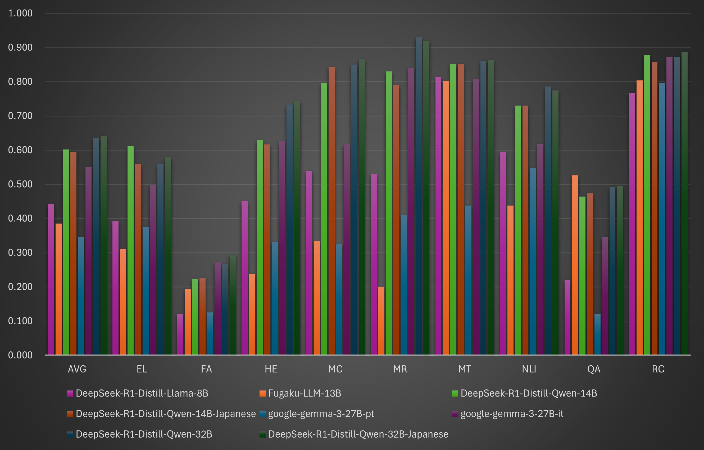

# **LLM evaluation result**

Evaluate the capabilities of the LLM through benchmark testing.

## **llm-jp-eval**

[llm-jp-eval](https://github.com/llm-jp/llm-jp-eval) is a benchmark developed under the [LLM-jp](https://llm-jp.nii.ac.jp) project led by the National Institute of Informatics (NII). 
It automatically evaluates Japanese LLMs across multiple datasets.

> [LLM-jp: A Cross-organizational Project for the Research and Development of Fully Open Japanese LLMs](https://arxiv.org/html/2407.03963v1)  
> [llm-jp-eval: 日本語大規模言語モデルの自動評価ツール](https://www.anlp.jp/proceedings/annual_meeting/2024/pdf_dir/A8-2.pdf)

| Category | Task | Dataset |
| ---- | ---- | ---- |
| EL | Entity linking | chABSA |
| FA | Reading prediction, Named entity recognition, Dependency parsing,   Predicate-argument structure analysis, Coreference resolution | Wikipedia Annotated Corpus |
| HE | Human examination | MMLU, JMMLU |
| MC | Multiple choice question answering | JCommonsenseQA |
| MR | Mathematical reasoning | MAWPS |
| MT | Mathematical translation | ALT Parallel Corpus, Wikipedia’s Kyoto Articles |
| NLI | Natural language inference | Jamp, JaNLI, JNLI, JSeM, JSICK |
| QA | Question answering | JEMHopQA, NIILC |
| RC | Reading comprehension | JSQuAD |

### Condition
  - Site : NVIDIA GH200, GraceCPU(72 ARM Neoverse V2 cores), H100 Tensor Core GPU
  - Singularity Container : [llm-jp-eval](https://github.com/RIKEN-RCCS/singularity_defpack/tree/main/gpu_nvidia/llm-jp-eval) which contains CUDA Version 12.4 and PyTorch Version 2.4.0a0+07cecf4

### Result

> [llm-jp/open-japanese-llm-leaderboard](https://huggingface.co/spaces/llm-jp/open-japanese-llm-leaderboard)

| Model                         | AVG   | EL    | FA    | HE    | MC    | MR    | MT    | NLI   | QA    | RC    |
| ----                          | ----: | ----: | ----: | ----: | ----: | ----: | ----: | ----: | ----: | ----: |
| DeepSeek-R1-Distill-Qwen-1.5B | 0.270 | 0.176 | 0.033 | 0.317 | 0.307 | 0.410 | 0.438 | 0.448 | 0.197 | 0.376 |
| open-calm-7b                  | 0.257 | 0.085 | 0.018 | 0.210 | 0.347 | 0.000 | 0.581 | 0.452 | 0.364 | 0.509 |
| DeepSeek-R1-Distill-Qwen-7B   | 0.425 | 0.293 | 0.060 | 0.467 | 0.560 | 0.730 | 0.645 | 0.588 | 0.252 | 0.658 |
| DeepSeek-R1-Distill-Llama-8B  | 0.443 | 0.392 | 0.121 | 0.450 | 0.540 | 0.530 | 0.813 | 0.596 | 0.220 | 0.767 |
| Fugaku-LLM-13B                | 0.385 | 0.311 | 0.194 | 0.237 | 0.333 | 0.200 | 0.802 | 0.438 | 0.526 | 0.804 |
| DeepSeek-R1-Distill-Qwen-14B  | 0.602 | 0.612 | 0.223 | 0.630 | 0.797 | 0.830 | 0.851 | 0.730 | 0.464 | 0.878 |
| DeepSeek-R1-Distill-Qwen-14B-Japanese | 0.595 | 0.559 | 0.226 | 0.617 | 0.843 | 0.790 | 0.852 | 0.730 | 0.473 | 0.857 |
| google-gemma-3-27B-pt         | 0.347 | 0.376 | 0.125 | 0.330 | 0.327 | 0.410 | 0.437 | 0.548 | 0.120 | 0.795 |
| google-gemma-3-27B-it         | 0.550 | 0.497 | 0.271 | 0.627 | 0.617 | 0.840 | 0.809 | 0.618 | 0.345 | 0.874 |
| DeepSeek-R1-Distill-Qwen-32B  | 0.635 | 0.560 | 0.267 | 0.733 | 0.850 | 0.930 | 0.861 | 0.786 | 0.493 | 0.872 |
| DeepSeek-R1-Distill-Qwen-32B-Japanese | 0.642 | 0.579 | 0.294 | 0.743 | 0.867 | 0.920 | 0.864 | 0.774 | 0.495 | 0.887 |

> The measurement results are unavailable because **DeepSeek-R1-Distill-Qwen-70B** did not complete execution within the job scheduler's 24-hour time limit.
